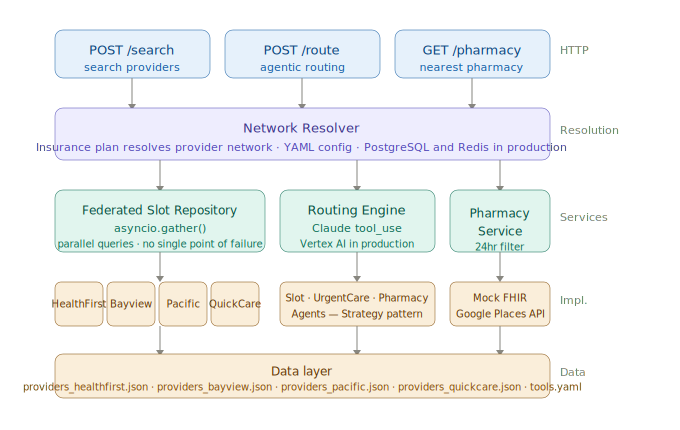
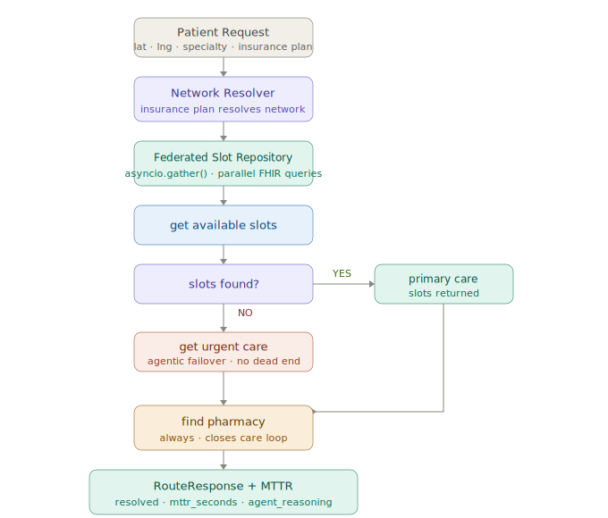

# Continuum Health
### From Passive EHR Search to Agentic Patient Access

> Product vision: [Continuum on Medium](https://medium.com/@cheruvu.ranjani/continuum-moving-from-passive-ehr-search-to-agentic-patient-access-4455a15786a0)

> Live demo: [continuum-health.onrender.com](https://continuum-health-chat.onrender.com)

> Live API: [continuum-health-api.onrender.com/redoc](https://continuum-health.onrender.com/redoc)

---

## The Problem

Navigating the healthcare system as an end user makes one thing clear. The data exists but the intelligence to act on it does not.

EHR systems solve for data capture. Patient portals solve for data access. Neither solves for data comprehension at the point of delivery.

The gap is not in infrastructure. It lies in the experience layer.

The problem worth solving is the silent failure. A claim that should have been flagged. A denial pattern that only becomes visible in aggregate. A reconciliation mismatch that bleeds quietly for months. These failures do not announce themselves. They accumulate.

Continuum is a product framework that treats patient access as an intelligent routing problem, not a scheduling problem. This repository is the proof of concept.

---

## The Appointment Paradox

Every day, a motivated patient opens an EHR portal, hits a wall of unavailability, and quietly disappears. No error message. No alternative. The system registered the visit. It never resolved the need.

In most industries, we would call this an incident. We would measure how long it took to resolve. We would build systems to reduce that time.

Healthcare tracks access in fragments. Time to appointment here, slot utilization there, abandonment rate nowhere.

What is missing is not better search. It is a resolution metric.

---

## The Three-Sided Problem

Before designing the solution, it helps to name who is losing.

The patient cannot find an appointment, does not know where to go next, and abandons. Often seeking care through a more expensive fragmented channel like a standalone urgent care or ER.

The provider is operating an EHR as a passive listing service. Unfilled slots represent direct access failure. Not all systems were built to actively match capacity to demand in real time.

The health system absorbs both. Lower slot utilization, higher patient acquisition costs, reduced care continuity.

From all perspectives this looks like a calendar problem. It is actually an intelligent routing problem.

---

## MTTR as the North Star

Continuum introduces MTTR, Mean Time To Resolution, as the north star metric for patient access. The elapsed time from search initiation to confirmed care pathway.

Every architectural decision exists to reduce this number. Insurance network resolution, parallel FHIR federation, agentic failover, pharmacy suggestion. All of it serves one metric.

| Stakeholder | What they track today | What MTTR gives them |
|-------------|----------------------|----------------------|
| Engineering | API latency, uptime | End to end resolution speed |
| Clinical Ops | Slot utilization | Care pathway completion rate |
| Leadership | Patient acquisition cost | Access leakage rate |

When patient access has an MTTR, it stops being a scheduling problem owned by operations and becomes a product health metric owned by a cross functional team, with a clear mandate to improve it phase by phase.

---

## What Continuum Does

Instead of returning a static list of providers, Continuum orchestrates a dynamic resolution pathway.

The patient's insurance plan resolves the correct provider network. All in-network health systems are queried simultaneously. The agent routes to the best available primary care slot. When primary care is exhausted, it autonomously escalates to urgent care without patient intervention. The nearest in-network pharmacy is always surfaced to close the care loop. Every resolution is recorded as MTTR.

The routing decision is made by Claude (Anthropic) using autonomous tool calling. No hardcoded rules. The agent reasons over live availability data and decides the pathway.

---

## Live Demo

Try the chatbot: [continuum-health.onrender.com](https://continuum-health-chat.onrender.com)

Walk through the conversational flow. Select your insurance plan and location. Continuum resolves your provider network, routes you to the nearest available slot, and surfaces an in-network pharmacy. Everything tracked as MTTR in the dashboard tab.

Note: Hosted on Render free tier. First request may take 30 seconds to wake the service.

---

## System Architecture



---

## Agentic Routing Flow



---

## Insurance Driven Network Resolution

The routing engine never sees a hardcoded provider list. Insurance plan determines which health systems are queried, dynamically, at request time.

```
Patient: HealthFirst HMO
      HMO network resolved
      HealthFirst Medical queried exclusively
      Claude routes within that network

Patient: MedConnect PPO
      PPO network resolved
      Bayview Health + Pacific Medical Group
      queried simultaneously via asyncio.gather()
      results merged and sorted by drive time
      Claude routes to closest available slot

Patient: Uninsured
      Open network resolved
      All networks queried in parallel
      Maximum coverage, no restriction
```

Adding a new insurance plan requires one new entry in `network_config.yaml`. Zero code changes.

---

## Supported Networks

| Insurance Plan | Network Type | Health Systems |
|---------------|-------------|----------------|
| HealthFirst HMO | HMO | HealthFirst Medical |
| MedConnect PPO | PPO | Bayview Health + Pacific Medical Group |
| CareShield PPO | PPO | Bayview Health + Pacific Medical Group |
| UnityHealth PPO | PPO | Bayview Health + Pacific Medical Group |
| ClearPath PPO | PPO | Bayview Health + Pacific Medical Group |
| Uninsured / Self Pay | Open | Bayview + Pacific + QuickCare + CityUrgent Care |

---

## Key Product Metrics

| Metric | Definition | Signal |
|--------|-----------|--------|
| MTTR | Search to confirmed care pathway | North star. Everything exists to reduce this |
| Leakage rate | Patients who exit without resolution | Every 1% reduction is a direct win |
| Agentic deflection rate | Zero slot scenarios routed to urgent care vs dead end | Measures whether failover logic works |
| Radius expansion rate | How often agent expands beyond default radius | Rising rate signals a capacity problem not a routing problem |

---

## Product Roadmap

**Phase 1: Intelligent Edge (current)**

Insurance driven network resolution. Parallel FHIR endpoint queries. Claude agentic routing with primary care and urgent care failover. Pharmacy care loop closure. MTTR tracked end to end.

**Phase 2: Federated Agentic Routing**

Real GCP Healthcare API integration across live EHR endpoints. Google Distance Matrix API for drive time accuracy. Real time insurance verification via payer API. Federated Urgent Care Index.

**Phase 3: Predictive Access and Memory**

Wait time prediction using Vertex AI trained on historical operational data. Particularly valuable for pediatric care where wait time tolerance is low. Agent memory persistence across sessions so every subsequent interaction starts from context, not zero.

---

## Strategic Impact

Continuum transforms patient access from a passive scheduling interface into an active care resolution system.

The system does not fix a calendar. It builds an intelligent routing layer that treats every unfilled slot as a solvable matching problem and every patient abandonment as an open incident with a measurable time to resolution.

For health systems operating on thin margins, the difference between a passive search portal and an active agentic orchestrator is not a UX improvement. It is a structural shift in how patient demand converts to clinical capacity. Tracked, measured, and continuously improved.

---

<details>
<summary>Technical reference: architecture, setup, API</summary>

## Tech Stack

| Layer | Current | Production Path |
|-------|---------|-----------------|
| AI Routing Engine | Claude tool_use (Anthropic) | Vertex AI Gemini 2.0 Flash, HIPAA boundary |
| Network Resolution | YAML config | PostgreSQL + Redis cache-aside |
| EHR Data Layer | Mock FHIR JSON per health system | GCP Healthcare API |
| Parallel Federation | asyncio.gather() | asyncio.gather(), same pattern |
| Distance Calculation | Haversine formula | Google Distance Matrix API |
| Pharmacy Lookup | Mock JSON | Google Places API + insurance network |
| Insurance Verification | Plan name matching | Payer API (Availity / Change Healthcare) |
| API Framework | FastAPI | |
| Demo UI | Streamlit | |
| Deploy | Render.io | |

## Project Structure

```
continuum-health/
├── app/
│   ├── agents/                    # Claude tool handlers
│   ├── interfaces/                # Abstract contracts
│   ├── models/                    # Pydantic schemas
│   ├── repository/                # Data access layer
│   ├── services/                  # Business logic layer
│   ├── routers/                   # FastAPI HTTP endpoints
│   ├── core/
│   │   ├── config.py
│   │   ├── cache.py
│   │   └── network_config.yaml    # Insurance network definitions
│   ├── data/                      # Mock FHIR fixtures
│   └── static/                    # Chatbot UI assets
├── tests/
├── docs/
├── streamlit_app.py
├── .env.example
└── requirements.txt
```

## Run Locally

```bash
git clone 
cd continuum-health

python3.11 -m venv venv
source venv/bin/activate
pip install -r requirements.txt

cp .env.example .env
# add your ANTHROPIC_API_KEY

# API
uvicorn app.main:app --reload

# Chatbot (separate terminal)
streamlit run streamlit_app.py
```

API docs: http://localhost:8000/redoc
Chatbot: http://localhost:8501

## Example Requests

```bash
# HealthFirst HMO
curl -X POST http://localhost:8000/api/v1/route \
  -H "Content-Type: application/json" \
  -d '{"lat": 37.7749, "lng": -122.4194,
       "specialty": "primary_care", "insurance": "healthfirst"}'

# MedConnect PPO
curl -X POST http://localhost:8000/api/v1/route \
  -H "Content-Type: application/json" \
  -d '{"lat": 37.7749, "lng": -122.4194,
       "specialty": "primary_care", "insurance": "medconnect"}'
```

</details>

---

## Disclaimer

Continuum is a portfolio and educational project. All provider names, insurance plans, health systems, phone numbers, and availability data are entirely fictional and used for illustrative purposes only. This project is not affiliated with, representative of, or endorsed by any real health system, insurance provider, or healthcare organization. Not medical, legal, or regulatory advice.

---

Built by Ranjani Renganathan - AI Product Manager 
